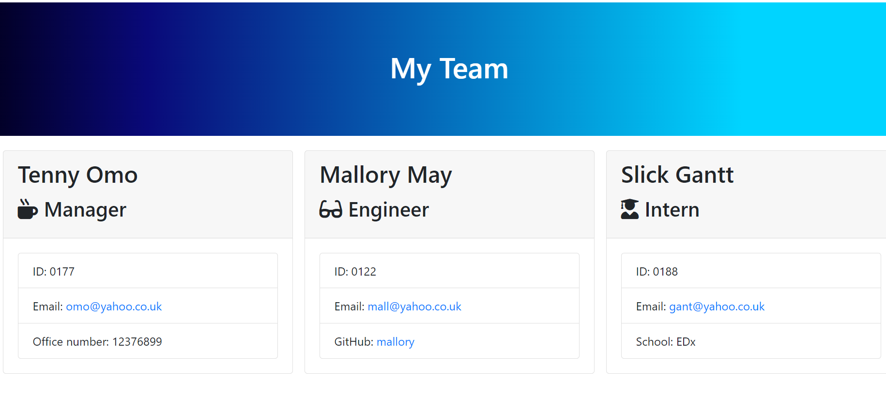

# Team Profile Generator

[](https://opensource.org/licenses/MIT)
## Table of Contents 
* [Description](#description​)

* [Screenshot](#screenshot)

* [Installation](#installation)

* [License](#license)
​
* [Usage](#usage)
​
* [Contributing](#contributing)

* [Tests](#tests)

* [Credits](#credits)

## Description​

A simple application using Node.js, that generates a series of Employee cards from the users input.

Upon running the code with ```node index```, the user is prompted to answer a series of questions on the members of their team.

After answering the initial manager content, the user has the option to add an Engineer or Intern, or complete the programme.

Upon completion, the programme generates a HTML file in the output folder, that displays all the team members that have been entered by the user.

This application uses node, the file System to access the command line and write a new file, the inquirer package for user input and validation and finally Jest for testing.

## Screenshot


​
## Installation
​
Node.js is required to use this generator.

To install the necessary dependencies, run the following command:
​
```
npm install
```

## Usage
​
To start the generation process, type `node index.js` or `node index`
​
## License


This project is licensed under the MIT License

    
## Contributing
​
Fork and pull request.
​
## Tests
​
To run tests, run the following command:
​
```
npm test
```

## Credits
* EDx Instructors and TAs.


